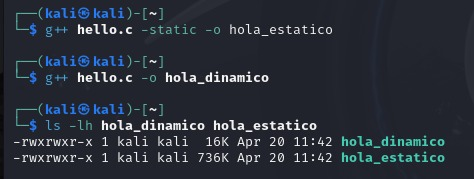
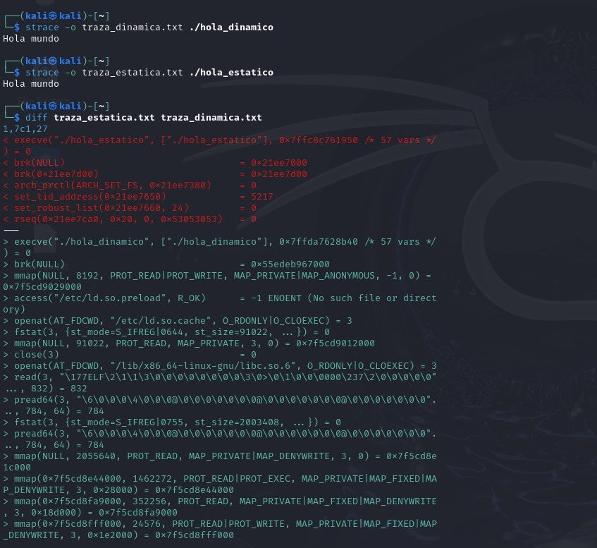

# Laboratorio: Computación en el Borde IoT

**Nombre:** <Samuel Sabogal> <Julian Vazquez>
**Asignatura:** Computación en el Borde IoT  

---

## 1. Enlazado Estático vs. Dinámico

### Contexto

El sistema operativo necesita cargar las instrucciones a la memoria. Las dependencias pueden empaquetarse dentro del mismo archivo **(estático)** o invocarse en tiempo de ejecución **(dinámico)**.

### Compilación

```bash
g++ hola.cpp -o hola_dinamico
g++ hola.cpp -static -o hola_estatico
```

### Tamaño de los binarios

```bash
ls -lh hola_dinamico hola_estatico
```

| Binario | Tamaño |
|---|---|
| `hola_dinamico` | ~16 KB |
| `hola_estatico` | ~1.2 MB |

> **Análisis:** El archivo estático es mucho más grande porque incluye todas las funciones de la librería estándar de C++ dentro del ejecutable. El dinámico solo guarda una referencia para buscarlas en el sistema operativo al ejecutarse.

### Dependencias (`ldd`)

```bash
ldd hola_dinamico
ldd hola_estatico
```

> **Análisis:** El binario dinámico muestra dependencias como `libc.so.6`, `libstdc++.so.6` y `libm.so.6`. El binario estático responde con `not a dynamic executable` porque no depende de ninguna librería externa del sistema.

### Trazabilidad de Syscalls (`strace`)

```bash
strace -o traza_dinamica.txt ./hola_dinamico
strace -o traza_estatica.txt ./hola_estatico
diff traza_estatica.txt traza_dinamica.txt
```

> **Análisis:** La versión dinámica ejecuta un grupo de llamadas al sistema **exclusivas** antes de poder imprimir el texto:
>
> - `openat` → Abre el archivo de la librería `libc.so.6` desde el disco.
> - `read` / `pread64` → Lee el contenido de esa librería.
> - `mmap` → Mapea (carga) la librería en la memoria RAM del proceso.
> - `mprotect` → Establece permisos de solo lectura sobre las páginas de memoria de la librería.
>
> La versión estática **no ejecuta ninguna de estas llamadas** porque ya tiene el código de las librerías empaquetado dentro del binario. Pasa casi directamente a ejecutar su lógica principal.

---

## 2. Análisis de Delay y Uso de CPU

### Contexto

Se implementó un programa con `usleep(2000000)` para generar una pausa de exactamente 2 segundos y se analizó el comportamiento del procesador durante ese tiempo.

### Código

```c
#include <stdio.h>
#include <unistd.h>

int main() {
    printf("Esperando ...\n");
    usleep(2000000); // 2 segundos
    printf("2 segundos despues\n");
    return 0;
}
```

### Medición con `time`

```bash
time ./delay
```

### Resultados

| Métrica | Valor |
|---|---|
| `real` | 2.00s |
| `user` | 0.00s |
| `sys` | 0.00s |
| `cpu` | 0% |

> **Análisis:** El tiempo `real` es de 2 segundos porque es lo que transcurrió en el reloj del mundo real. Sin embargo, los tiempos `user` y `sys` son cero porque `usleep` es una **llamada de bloqueo no activa**. El programa le indica al Kernel que no requiere el procesador durante ese intervalo, liberándolo para otros procesos. Si se hubiera usado un ciclo `while` vacío (busy-wait), el `user` habría marcado ~2.00s y el CPU habría llegado al 100%.

---

## 3. Manejo de Memoria: Stack vs Heap

### Contexto

La memoria de un programa se divide en regiones. Las dos más importantes para el programador son el **Stack** y el **Heap**, ambas ubicadas en la RAM.

### Definiciones

| Característica | Stack | Heap |
|---|---|---|
| **Ubicación** | RAM | RAM |
| **Gestión** | Automática (el compilador) | Manual (`malloc` / `free`) |
| **Tamaño** | Pequeño (~8 MB) | Grande (casi toda la RAM) |
| **Velocidad** | Muy rápido | Más lento |
| **Tiempo de vida** | Hasta que termina la función | Hasta que se llama `free` |
| **Error por exceso** | Stack Overflow | Out of Memory |

### Código implementado

```c
#include <stdio.h>
#include <stdlib.h>

int main() {
    // STACK: variable local, se elimina al terminar main()
    int x = 10;
    printf("Stack - x vale: %d, direccion: %p\n", x, (void *)&x);

    // HEAP: memoria solicitada manualmente, persiste hasta free()
    int *numeros = malloc(5 * sizeof(int));
    numeros[0] = 10;
    numeros[1] = 400;
    printf("Heap - numeros[0]: %d, direccion: %p\n", numeros[0], (void *)numeros);

    free(numeros); // liberar memoria
    return 0;
}
```

> **Análisis:** Al imprimir las direcciones de memoria con `%p`, se puede observar que la variable del Stack tiene una dirección alta (ej. `0x7fff...`) mientras que la del Heap tiene una dirección baja (ej. `0x55e...`). Esto confirma que el sistema operativo las almacena en **segmentos físicos separados** de la RAM. El Heap es la opción correcta cuando se necesita almacenar grandes volúmenes de datos o cuando los datos deben persistir más allá del alcance de una función.

---

## 4. Concurrencia: Procesos vs Hilos

### Contexto

Para ejecutar tareas en paralelo existen dos modelos: **Procesos** (aislados, se comunican por pipes) e **Hilos** (comparten memoria, requieren mutex para sincronización).

Se implementó un contador de frecuencia de palabras del archivo `2000.txt` (Don Quijote de la Mancha) usando ambos modelos.

### Descarga del archivo

```bash
curl -L -o 2000.txt https://www.gutenberg.org/ebooks/2000.txt.utf-8
```

---

### A. Versión Procesos (`wordfreq_proc.cpp`)

#### Funcionamiento

```
[PADRE] Lee el archivo → envía palabras por pipe → [HIJO] recibe y cuenta
```

#### Compilación y ejecución

```bash
g++ -O2 -std=c++17 wordfreq_proc.cpp -o wordfreq_proc
./wordfreq_proc 2000.txt
```

#### Análisis en `top`

```bash
top
```

> **Análisis:** En `top` se observan **dos filas con PIDs distintos**, correspondientes al proceso padre y al proceso hijo. La memoria `RES` no se duplica exactamente porque Linux utiliza el mecanismo **Copy-on-Write (CoW)**: al hacer `fork()`, ambos procesos comparten las mismas páginas físicas de RAM hasta que uno de ellos intenta modificarlas. Solo en ese momento el sistema operativo crea una copia privada para ese proceso.

---

### B. Versión Hilos (`wordfreq_threads.cpp`)

#### Funcionamiento

```
[Hilo Productor] Lee y encola palabras → [Hilo Consumidor] desencola y cuenta
```

Ambos hilos comparten la misma cola protegida por un `mutex`.

#### Compilación y ejecución

```bash
g++ -O2 -std=c++17 -pthread wordfreq_threads.cpp -o wordfreq_threads
./wordfreq_threads 2000.txt
```

#### Análisis en `top`

```bash
top
# Presionar f → activar TGID → q para volver
# Presionar H para ver hilos individualmente
```

> **Análisis:** Al activar la vista de hilos en `top` se observa lo siguiente:
>
> - **TID (Thread ID):** Es **diferente** para cada hilo. Identifica cada tarea de ejecución de forma individual dentro del sistema operativo.
> - **TGID (Thread Group ID):** Es **idéntico** para todos los hilos. Corresponde al PID del proceso que los creó, confirmando que todos pertenecen al mismo proceso.
> - **Memoria RES:** Es **exactamente la misma** para todos los hilos porque, a diferencia de los procesos, los hilos **comparten el mismo espacio de direcciones de memoria**. No hay duplicación de RAM. Cada hilo solo tiene su propio Stack privado (pequeño), pero el Heap y el código son compartidos.

---

## Conclusiones

> **1. Portabilidad vs Eficiencia de almacenamiento:**  
> El enlazado estático garantiza que un programa funcione en cualquier sistema Linux sin instalar dependencias, a costa de un mayor uso de almacenamiento en disco.

> **2. Gestión eficiente del procesador:**  
> Es fundamental diferenciar entre esperas activas (busy-wait, consume 100% CPU) y esperas bloqueantes como `usleep` (libera el CPU). En sistemas embebidos y edge computing esto es crítico para el consumo energético.

> **3. Elección correcta de memoria:**  
> El Stack es ideal para variables pequeñas y temporales. El Heap es indispensable para manejar grandes volúmenes de datos o estructuras que deben persistir durante toda la ejecución del programa.

> **4. Modelos de concurrencia:**  
> Los **hilos** son más eficientes en memoria al compartir el espacio de direcciones, pero requieren sincronización cuidadosa con `mutex` para evitar condiciones de carrera. Los **procesos** ofrecen aislamiento total pero son más costosos en recursos y requieren mecanismos explícitos de comunicación como los `pipes`.
